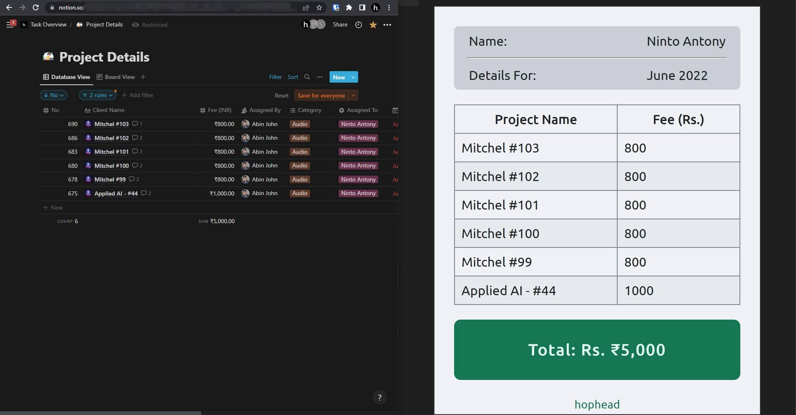

# Fee Details Generator

A NodeJS application that reads a Notion project management database and generates project and fee details summaries for the contract workers.

## Some Context -

My friend and I run a podcast post-production agency called [Hophead](https://www.hophead.in) where we have a few contract workers who we assign projects to via Notion. Before making the monthly payments we send them a summary sheet of the projects completed and money earned for the previous month.

These summary sheets were earlier made manually on Canva, which as you can expect, is a tedious process. It became more cumbersome as the number of members increased. So when Notion released their public API I was quite excited to test it out and see if I could automate the summary generation process.

This repo is the culmination of what has been a thrilling learning experience. I started with this idea in September 2021 when I had zero knowledge of Javascript. Since then I've picked up the language and grown as a developer, and the codebase has evolved with me as well. From creating [a fully front-end version](https://github.com/abinjohn123/hophead-stub-MKIII.git) whose API calls had to be made through Postman, to this NodeJS application that fetches the details and generates the summary with a single command, I've learned a ton.

I plan to take this further by adding functionalities to mail these summaries (I haven't been able to figure out Microsoft Graph yet) and also generate the final payment stub that will include transaction ID of the amount transferred and additional allowances.

## To-Do

[ ] Feature to email the summaries to the contractors.
[ ] Extend the app to generate pay stubs.
